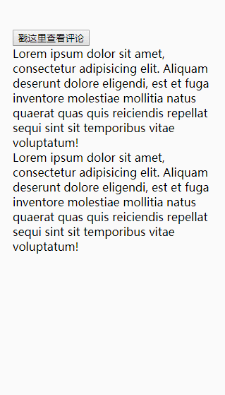

### 仿抖音评论区移动端弹出框

## 需求

* 从底部向上滑动，页面内容不跟随弹窗的滑动而滑动,滚动到页面的2/3的高度

* 背景有个透明的弹窗弹出

* 弹窗内容太多，可以滑动



## 思路

### 为了方便测试，本地起一个服务，这里我选择了gulp

具体配置可以[参考](https://github.com/AveVlad/gulp-connect)

初始化一个package.json文件

> npm init -y 

安装gulp和gulp-connect插件

> npm i gulp gulp-connect -D

在项目的根目录下新建一个gulpfile.js配置文件如下：

``` javascript

var gulp = require('gulp');
var connect = require('gulp-connect');

gulp.task('webserver', function () {

    connect.server({
        host: '192.168.1.109',// 本地的ip
        livereload: true,
        port: 8080
    });

});

gulp.task('default', ['webserver']);

```

> gulp 启动服务(默认找到根目录下的index.html)

> 移动端在同一局域网下，输入http://192.168.1.109:8080即可访问

### 样式选择了less

> npm i gulp-less -D

配置

``` javascript

gulp.task('less2css', function () {
    gulp.src('src/*.less')
        .pipe(less())
        .pipe(gulp.dest('src'))
})

// 监听less文件变化，随时执行less任务
gulp.task('lessAuto2css', function () {
    gulp.watch('src/*.less', ['less2css'])
})

```
> npm i gulp-autoprefixer -D

根据不同的浏览器添加前缀

### 使用flex布局

### 动画

使用css3的 animation动画

> animation: name duration timing-function delay iteration-count direction;

``` css

animation: up 1s ease;
@keyframes up {
  from {
    transform: translateY(100%);
  }
  to {
    transform: translateY(0);
  }
}
    
animation: down 1s ease;
 @keyframes down {
   from {
     transform: translateY(0);
   }
   to {
     transform: translateY(100%);
   }
}  
 
```

说明：translateY()的百分比是跟自身的高度的比例


## 测试

ios，andriod，微信

## 问题

* overflow:auto在ios端滑动不流畅

``` css

overflow: auto;

-webkit-overflow-scrolling: touch;

```


